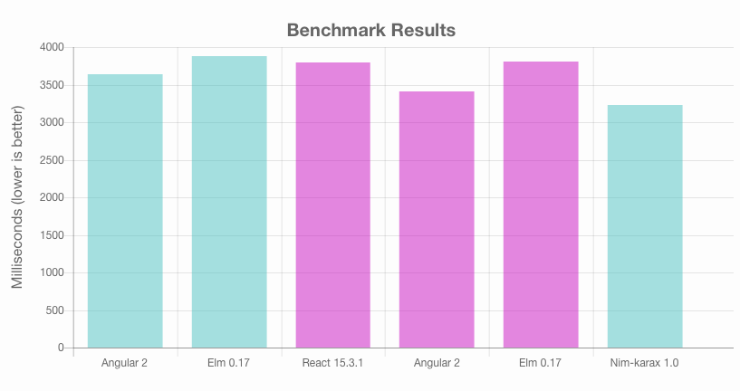

Karax – Single page applications in Nim |travis|
================================================

Karax is a framework for developing single page applications in Nim.
It's still in heavy development, so keep in mind that the API is subject
to change.

To try it out, run::

  cd ~/projects # Insert your favourite directory for projects

  nimble develop karax # This will clone Karax and create a link to it in ~/.nimble

  cd karax

  cd examples/todoapp
  nim js todoapp.nim
  open todoapp.html
  cd ../..

  cd examples/mediaplayer
  nim js playerapp.nim
  open playerapp.html

It uses a virtual DOM like React, but is much smaller than the existing
frameworks plus of course it's written in Nim for Nim. No external
dependencies! And thanks to Nim's whole program optimization only what
is used ends up in the generated JavaScript code. But don't take my
word for it, look at this:

Goals
=====

- Leverage Nim's macro system to produce a framework that allows
  for the development of applications that are boilerplate free.
- Keep it small, keep it fast, keep it flexible.

.. |travis| image:: https://travis-ci.org/pragmagic/karax.svg?branch=master
    :target: https://travis-ci.org/pragmagic/karax
